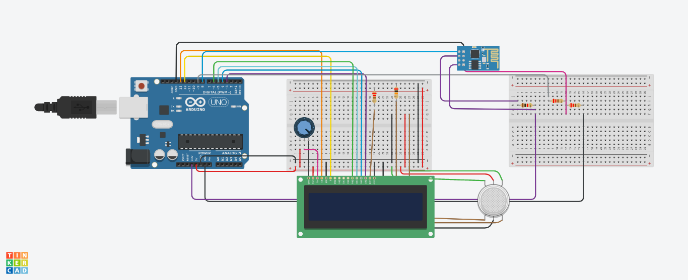

# Air-Quality-Monitoring-Project-By-Umraz-Hussain
 A IOT based Air Quality Monitoring Project By Umraz Hussain Using Arduino Uno  
 + System Design And Architechture.. 
  
  + <b color="green">Components Required 
 
    + Arduino Uno  
    + MQ-135 Gas Sensors  
    + ESP-8266 E12 WiFi model  
    + 16*2 LCD  
    + potentio meter  
    + Bread Board  
    + Jumper wires  
    
+ Connect your ESP-8266 with ThinkSpeak 
    
    
    
 Thank You... 
